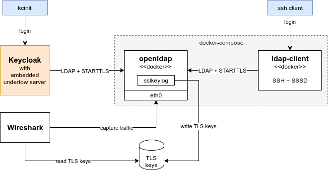

# Environment to develop, test and experiment with Keycloak and LDAP federation





## Preparation

Create certificates and keys for LDAP server and clients

```bash
go get -u github.com/tsaarni/certyaml             # install certyaml tool
mkdir -p certs
certyaml --destination certs configs/certs.yaml   # generate certificates and keys
```

Create truststore and keystore for Keycloak and LDAP server

```bash
keytool -importcert -storetype PKCS12 -keystore truststore.p12 -storepass password -noprompt -alias ca -file certs/ca.pem
openssl pkcs12 -export -passout pass:password -noiter -nomaciter -in certs/ldap-admin.pem -inkey certs/ldap-admin-key.pem -out admin-keystore.p12
openssl pkcs12 -export -passout pass:password -noiter -nomaciter -in certs/server.pem -inkey certs/server-key.pem -out server-keystore.p12
```

Set environment variable pointing to this repo

```bash
export WORKDIR=/home/tsaarni/work/keycloak-devenv
```


## Build and run test services

Run LDAP server (OpenLDAP) and LDAP client (SSH and SSSD)

```bash
docker-compose up
docker-compose rm -f  # clean previous containers
```


Test that LDAP is up and running

```bash
# dump configuration
docker exec keycloak-devenv_openldap_1 ldapsearch -H ldapi:/// -Y EXTERNAL -b cn=config

# dump users and groups
docker exec keycloak-devenv_openldap_1 slapcat -F /data/config

# dump user and groups by using `ldap-admin`
ldapsearch -D cn=ldap-admin,ou=users,o=example -w ldap-admin -b ou=users,o=example

# list user
ldapsearch -H ldaps://localhost:636  -b ou=users,o=example "(&(uid=user)(objectclass=inetOrgPerson)(objectclass=organizationalPerson))" -s one

# test bind (by changing password)
ldappasswd -ZZ -D cn=user,ou=users,o=example -w user -s user
```

The client configuration is read from `ldaprc` in home directory by default.
For parameters seem https://www.openldap.org/software/man.cgi?query=ldap.conf


## Running Keycloak

Clone keycloak repository, build and install to local maven repo at `~/.m2/repository`

```bash
mvn install -DskipTests
mvn clean install -DskipTests  # or alternatively: clean build
```

After editing part of the code, build and install only single module in
multi-module maven project (to save time)

```bash
mvn install -DskipTests -pl federation/ldap/
```

Run Keycloak with embedded undertow server

```bash
# -Dresources will trigger test server to read theme directly from themes directory
mvn -f testsuite/utils/pom.xml exec:java -Pkeycloak-server -Dkeycloak.migration.action=import -Dkeycloak.migration.provider=dir -Dkeycloak.migration.dir=$WORKDIR/migrations/ldap-federation/ -Djavax.net.ssl.trustStore=$WORKDIR/truststore.p12 -Djavax.net.ssl.trustStorePassword=password -Djavax.net.ssl.javax.net.ssl.trustStoreType="PKCS12" -Djavax.net.ssl.keyStore=$WORKDIR/admin-keystore.p12 -Djavax.net.ssl.keyStorePassword=password -Djavax.net.ssl.javax.net.ssl.keyStoreType="PKCS12" -Dresources
```

To login to keycloak using command linem use `kcinit` from keycloak

```bash
./testsuite/integration-arquillian/tests/base/target/kcinit login --config $WORKDIR/configs
```


When starting keycloak above, the realm configuration is imported from
$WORKDIR/keycloak
(see [here](https://github.com/keycloak/keycloak-documentation/blob/master/server_admin/topics/export-import.adoc))

To re-export realm after doing configuration changes:

1. Choose Export
    - Export groups and roles: on
    - Export clients: on
2. In `realm-export.json` find `bindCredential` and fill in LDAP bind password


To run in debugger, use `mvnDebug` instead of `mvn`.

```
mkdir -p .vscode
cp $WORKDIR/configs/launch.json .vscode/
```

Or to create release distribution packages

```
mvn install -DskipTests -Pdistribution
ls distribution/server-dist/target/keycloak*.tar.gz
```


## Capturing LDAP traffic

To debug LDAP traffic, first get the interface name from LDAP server container
and then run wireshark.

```bash
IFNAME=$(ip -j link show | jq -r ".[] | select(.ifindex==$(docker exec keycloak-devenv_openldap_1 cat /sys/class/net/eth0/iflink)) | .ifname")
wireshark -i $IFNAME -f "port 389 or port 636" -k -o tls.keylog_file:$WORKDIR/output/wireshark-keys.log
```

The LDAP server container uses openssl wrapper ([see here](docker/openldap/sslkeylog/))
that dumps TLS pre-master secrets to `output/wireshark-keys.log`.
This enables debugging LDAP over TLS.


To capture from Keycloak:

```
git clone https://github.com/neykov/extract-tls-secrets.git
cd extract-tls-secrets
mvn package
```

```diff
diff --git a/pom.xml b/pom.xml
index 1d01b52028..dea2243e56 100755
--- a/pom.xml
+++ b/pom.xml
@@ -1527,7 +1527,7 @@
                     <artifactId>maven-surefire-plugin</artifactId>
                     <configuration>
                         <forkMode>once</forkMode>
-                        <argLine>-Djava.awt.headless=true ${surefire.memory.settings}</argLine>
+                        <argLine>-Djava.awt.headless=true ${surefire.memory.settings} -javaagent:/home/tsaarni/packages/extract-tls-secrets/target/extract-tls-secrets-4.1.0-SNAPSHOT.jar=/home/tsaarni/work/keycloak-devenv/wireshark-keys.log</argLine>
                         <runOrder>alphabetical</runOrder>
                     </configuration>
                 </plugin>
```


## Using LDAP client

Run follownig to login to LDAP client container using LDAP user account

```bash
sshpass -p user ssh user@localhost -p 2222 -o UserKnownHostsFile=/dev/null -o StrictHostKeyChecking=no "echo Hello world!"
```


## Running unittest


# First build and install
mvn clean install -DskipTests
(cd distribution; mvn clean install)


# deploy EmbeddedLDAPServer (dependency of test suite)
mvn clean install -DskipTests -pl util/embedded-ldap/    

# run with remote debugger
mvn verify -DforkMode=never -Dmaven.surefire.debug -f testsuite/integration-arquillian/pom.xml -Dtest=org.keycloak.testsuite.federation.ldap.LDAPAnonymousBindTest -Dkeycloak.logging.level=debug

# run without debugger
mvn install -f testsuite/integration-arquillian/pom.xml -Dtest=org.keycloak.testsuite.federation.ldap.LDAPAnonymousBindTest -Dkeycloak.logging.level=debug
mvn install -f testsuite/integration-arquillian/pom.xml -Dtest=org.keycloak.testsuite.federation.ldap.*AuthTest -Dkeycloak.logging.level=debug


# run only LDAPEmbeddedServer
mvn exec:java -pl util/embedded-ldap/ -Dexec.mainClass=org.keycloak.util.ldap.LDAPEmbeddedServer
mvn exec:java -pl util/embedded-ldap/ -Dexec.mainClass=org.keycloak.util.ldap.LDAPEmbeddedServer -DenableSSL=true -DenableStartTLS=true -Djavax.net.ssl.trustStore=$WORKDIR/truststore.p12 -Djavax.net.ssl.trustStorePassword=password -Djavax.net.ssl.javax.net.ssl.trustStoreType="PKCS12" -DkeystoreFile=$WORKDIR/server-keystore.p12 -DcertificatePassword=password


ldapsearch -H ldap://localhost:10389 -D uid=admin,ou=system -w secret -b ou=People,dc=keycloak,dc=org

# anonymous bind
ldapsearch -H ldap://localhost:10389 -x -b ou=People,dc=keycloak,dc=org

# ldaps
LDAPTLS_REQCERT=never ldapsearch -H ldaps://localhost:10636 -x -D uid=admin,ou=system -w secret -b ou=People,dc=keycloak,dc=org
LDAPTLS_CACERT=/path
LDAPTLS_CERT=/path LDAPTLS_KEY=/path LDAPTLS_CACERT=/path

# starttls
LDAPTLS_REQCERT=never ldapsearch -H ldap://localhost:10389 -ZZ -D uid=admin,ou=system -w secret -b ou=People,dc=keycloak,dc=org

LDAPTLS_REQCERT=never LDAPTLS_CERT=certs/ldap-admin.pem LDAPTLS_KEY=certs/ldap-admin-key.pem ldapsearch -H ldap://localhost:10389 -ZZ -Y EXTERNAL -b ou=People,dc=keycloak,dc=org

LD_PRELOAD=./libsslkeylog.so SSLKEYLOGFILE=wireshark-keys.log LDAPSASL_MECH=EXTERNAL LDAPCA_CERT=$PWD/certs/ca.pem LDAPTLS_CERT=certs/foo.pem LDAPTLS_KEY=certs/foo-key.pem ldapsearch -ZZ -H ldap://localhost:10389 -b ou=People,dc=keycloak,dc=org


### Using REST API


https://github.com/keycloak/keycloak-documentation/blob/master/server_development/topics/admin-rest-api.adoc
https://www.keycloak.org/docs-api/10.0/rest-api/index.html


change "Access Token Lifespan" from 1 min to 100 days in realm settings

http://localhost:8081/auth/admin/master/console/#/realms/master/token-settings


TOKEN=$(http --form POST http://localhost:8081/auth/realms/master/protocol/openid-connect/token username=admin password=admin grant_type=password client_id=admin-cli | jq -r .access_token)

http -v GET http://localhost:8081/auth/admin/realms/master  Authorization:"bearer $TOKEN"

http -v GET http://localhost:8081/auth/admin/realms/master/users Authorization:"bearer $TOKEN"

http -v POST http://localhost:8081/auth/admin/realms/master/users Authorization:"bearer $TOKEN" username=foo

http -v POST http://localhost:8081/auth/admin/realms/master/users Authorization:"bearer $TOKEN" username=user3 enabled:=true totp:=false emailVerified:=false firstName="" lastName="" email="" credentials:='[{"type": "password", "value": "mypass", "temporary": false}]'


http -v http://localhost:8081/auth/realms/master/.well-known/openid-configuration 
http -v http://localhost:8081/auth/realms/master/protocol/openid-connect/certs


